## Good Day Everyone

Hope you all are doing well.

With this post, I'd like to share my learning on how to connect to your AWS EC2 instance using Windows SSH Client i.e. "Putty".
Though, there are several articles describing the steps, I'd like to share mine what I experienced during the task. 

This experience arose from the exercise that I was about to execute for installing gitlab-runner rpm on AWS EC2 instance running with AWS AMI.
During the creation of the EC2 instance, I generated the keypair with the .pem extension whhich is to be used with Open SSH. There is already an option to generate the keypair with .ppk extension which is compatible to use with Putty, However, I chose the default option i.e. .pem

Once the EC2 instance came up, I tried connecting to EC2 instance using SSH client i.e. Putty installed on my Windows machine.However, when I configured the SSH connection in Putty with the key (.pem) download from AWS, it didn't work and prompted me to use a key with .ppk extension.

I didn't want to generate another keypair for my EC2 instance, hence I looked through the process to use the same .pem keypair to connect to the EC2 instance, which involved generating .ppk keypair using PuTTygen.

Below are steps executed in the exercise.

## Steps Involved

- Setup AWS EC2 instance with a public IP address and keypair (.pem)

For setting up the EC2 instance, following inputs were provided during the creation. I chose AWS AMI for the machine.

```
Name: example-vm
Application and OS Image: Amazon Linux
```
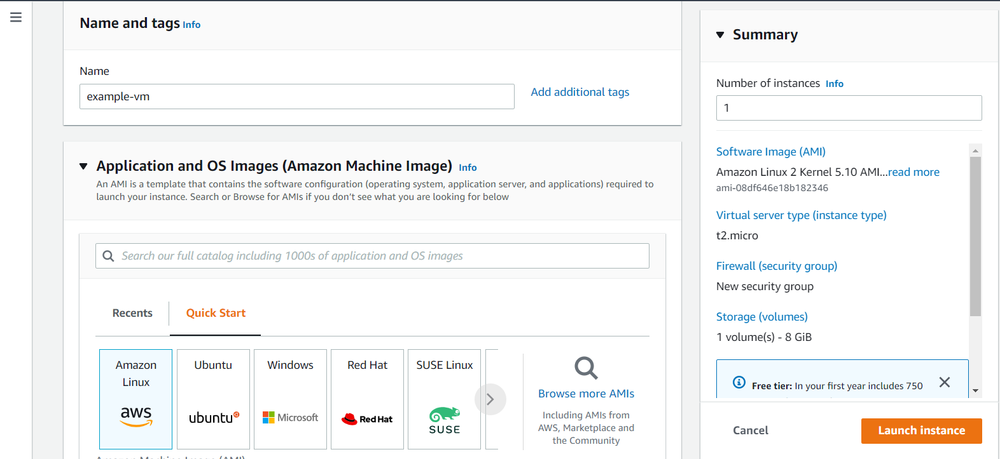

Instance type was set to t2.micro as it is available for free to use with free tier account.
Also, to connect the EC2 instance using external SSH client, I created a new keypair as I didn't have any to use from.

```
Instance Type: t2.micro (which is available for free in free tier account)
Key pair (login): Click on "create a new key pair"
```
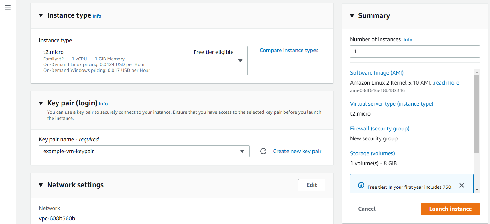

During the keypair creation, following inputs were provided. Keypair type was set to RSA and private key file format was set to .pem which are default choice. However, one can change these based on the requirement.

```
Key pair name: example-vm-keypair
Key pair type: RSA
Private key file format: .pem
```
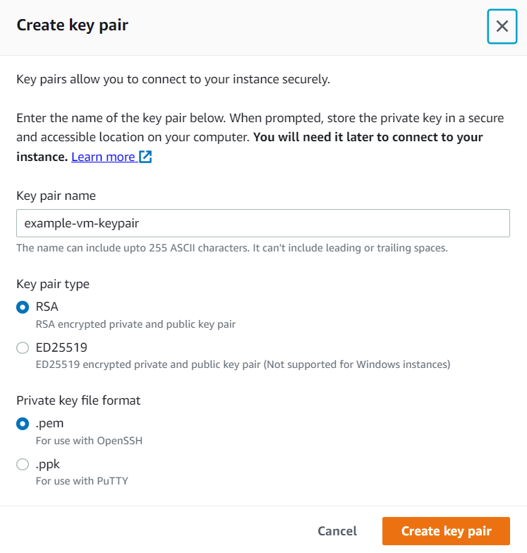

I made use of the default network settings ensuring that the EC2 instance is also assigned a public IP address to access it from the external machine.

```
Network Settings
```
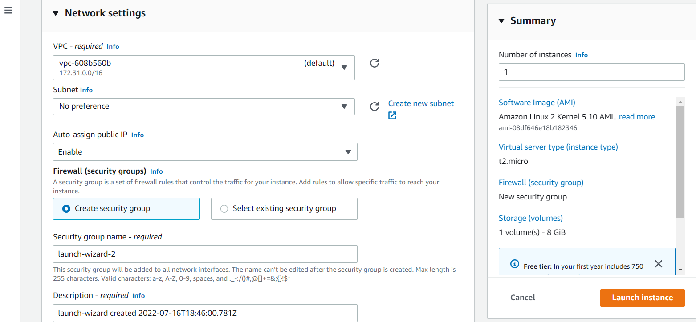

Once all the settings of EC2 instace are finalizedd, click on Launch Instance. You can check the status by navigating to EC2 --> Instances
Once the EC2 instane is UP and running, it will be shown as below.

```
Instances
```
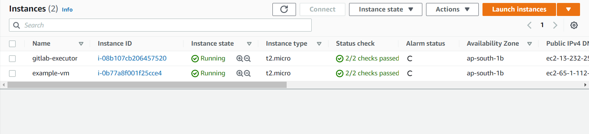


- Install PuTTy and PuTTYgen

If Putty is not installed on your Windows machine, you can refer the [link](https://www.putty.org/) to download the executable.
Once the Putty is installed, you'll also notice that there is another utility installed with the name "PuTTygen".

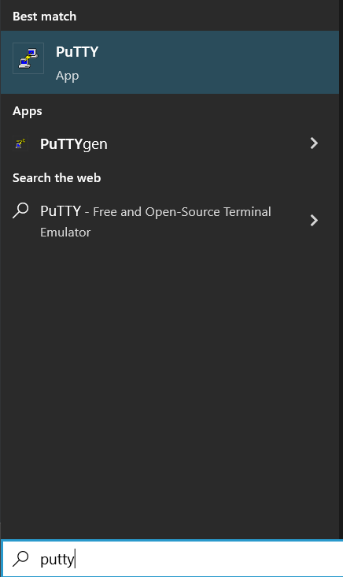

- Configure PuTTYgen

At this point, if you try to access the EC2 instance using PuTTy with keypair (.pem) generated earlier, you wouldn't be able to do that because PuTTy requires keypair with .ppk extension. Hence, it would show an error while loading the private key. For this purpose, we're going to generate the .ppk keypair with the help of .pem keypair.

Open PuTTygen and click on Load an existing private key file. Click on Load and browse to the keypair file with .pem extension

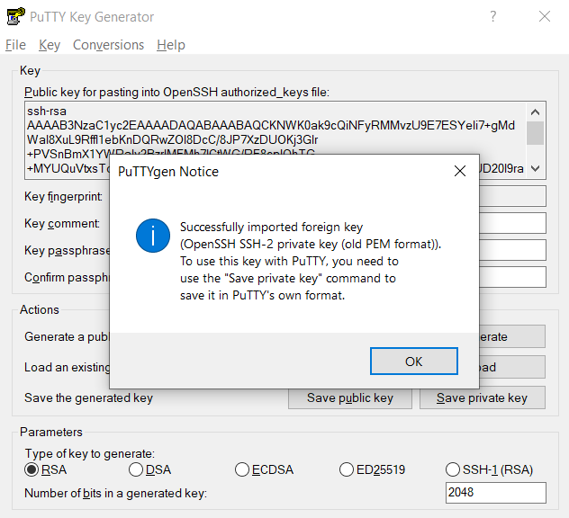

As soon as you select the .pem file, it gets loaded into PuTTygen.

Click on Save private key and select "yes" when prompted to save the file without passphrase. Save the file to a safe location on your machine.
This is keypair generated with .ppk extension which can further be used to configure PuTTy session to connect EC2 instance.

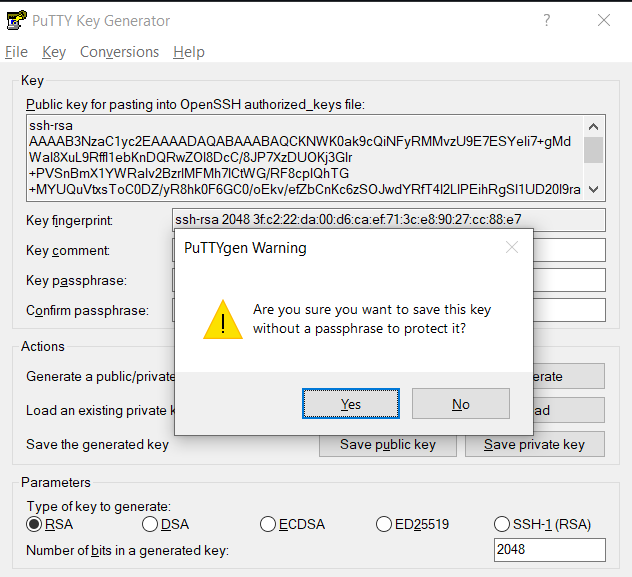

- Configure PuTTy

It is time to configure PuTTy to be able to connect to EC2 instance using the private keypair with .ppk extension you just generated.

Open the AWS console and navigate to the running instance. Click on the instance.
Copy either Public IPv4 address or Public IPv4 DNS Name.

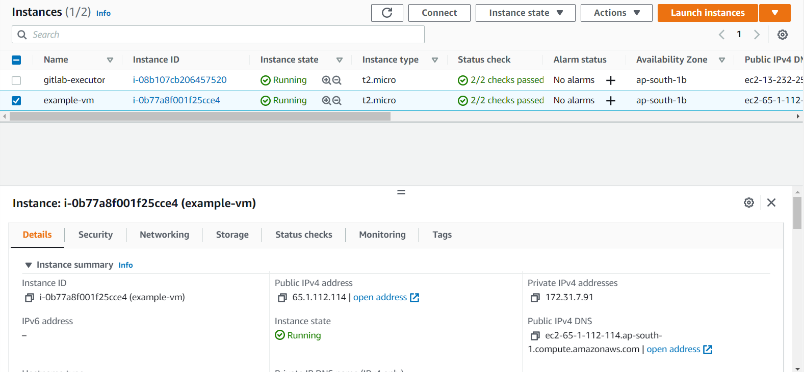

Open PuTTy on your Windows machine and configure new session for EC2 instance.
For this purpose, enter the public IPv4 address or public IPv4 DNS name in the Host Name field. By default, port is already set to 22 and connection type set to SSH.
If not, please do so.
To save the session, enter a name in the Saved Sessions field.

```
Host Name (or IP Address): Public IPv4 Address or Public IPv4 DNS Name
Port: 22
Connection Type: SSH
Saved Session: example-vm
```

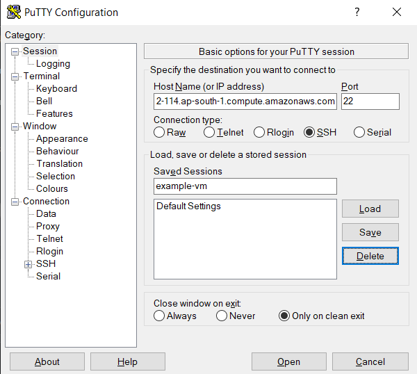

Navigate to Connection --> SSH --> Auth --> Private key file for authentication --> Browse and select the keypair file with .ppk extension

```
Private key file for authentication: example-vm-keypair.ppk
```

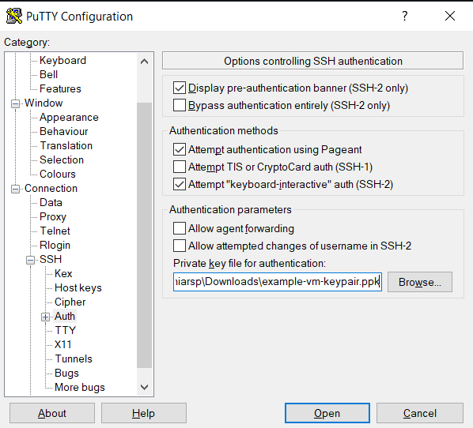

Navigate to Session and click Save to save the newly created session. Click on Open.

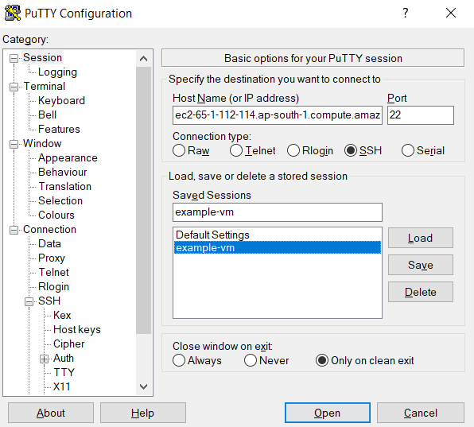

A new PuTTy window opens up and asks for your confirmation to save the key in PuTTy cache. Click Yes.

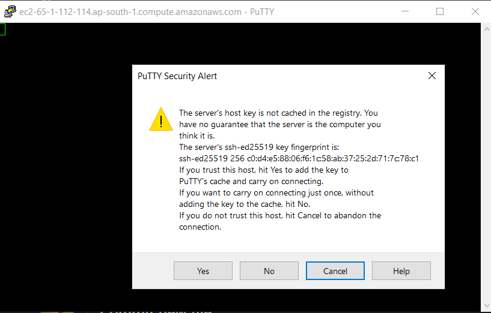

It will ask the username. Once entered, you are logged into the AWS EC2 machine without entering any password.

```
login as: ec2-user
```

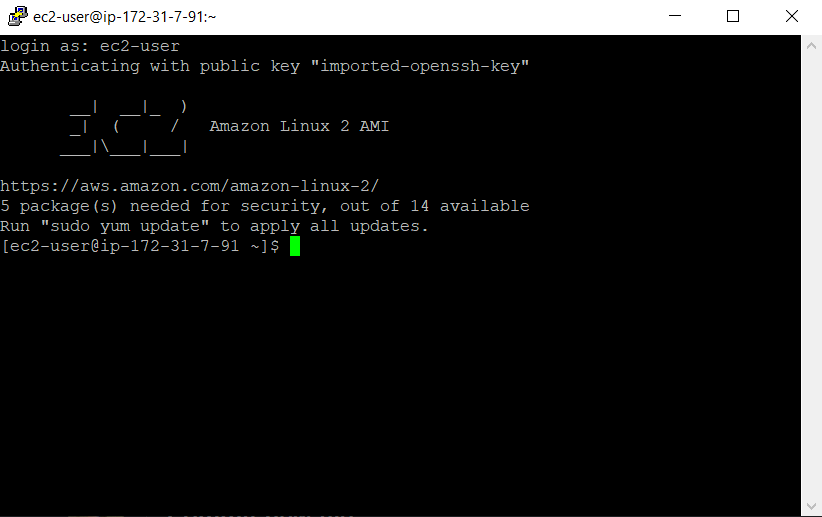

That is all Folks for now. I'll keep sharing my learnings. If my posts sound interesting to you, following are the places, where I can be reached.

Like, Share, Follow, Comment.

| [LinkedIn](https://www.linkedin.com/in/prabhatsingh/) | [Dev](https://dev.to/prabhatsingh014) | [Medium](https://medium.com/@prabhatsingh014) |
| ------ | ------ | ------ |
